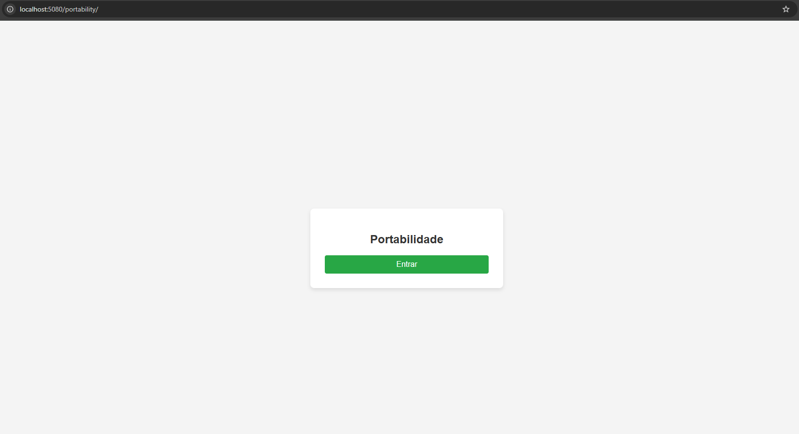
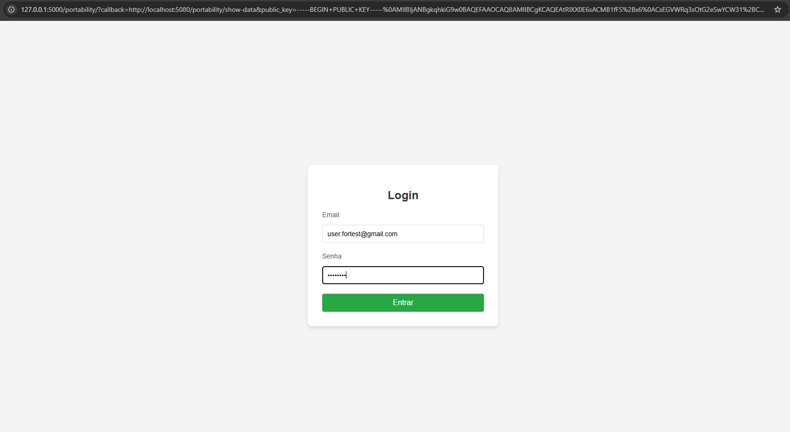
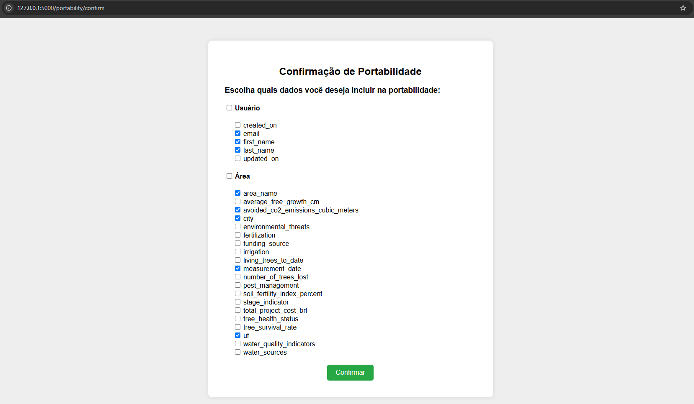
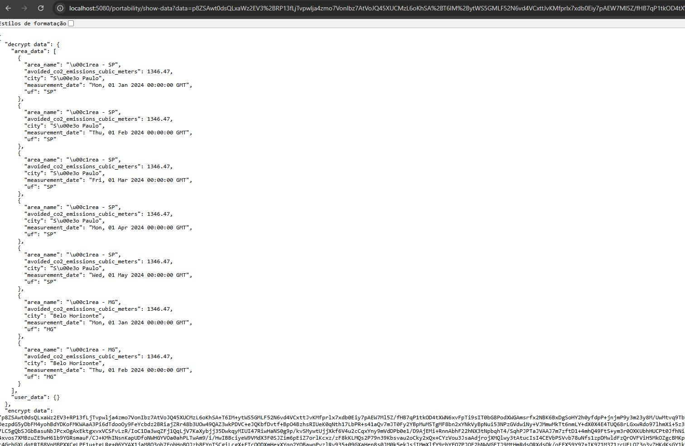

# Dados Pessoais

<!-- Lorem ipsum dolor sit amet, consectetur adipiscing elit. Sed non risus. Suspendisse lectus tortor, d
ignissim sit amet, adipiscing nec, ultricies sed, dolor...
Lorem ipsum dolor sit amet, consectetur adipiscing elit. Sed non risus. Suspendisse lectus t
ortor, dignissim sit amet, adipiscing nec, ultricies sed, dolor...
Lorem ipsum dolor sit amet, consectetur adipiscing elit. Sed non risus. Suspendisse lectus tortor, dignissim sit amet, 
adipiscing nec, ultricies sed, dolor...

## Atualização de Dados
Lorem ipsum dolor sit amet, consectetur adipiscing elit. Sed non risus.

Suspendisse lectus tortor, dignissim sit amet, adipiscing nec, ultricies sed, dolor...
Lorem ipsum dolor sit amet, consectetur adipiscing elit. Sed non risus. Suspendisse lectus tortor, dignissim sit amet, adipiscing nec, ultricies sed, dolor...

## Terms Page

Lorem ipsum dolor sit amet, consectetur adipiscing elit. 
Sed non risus. Suspendisse lectus tortor, dignissim sit amet, 
adipiscing nec, ultricies sed, dolor...
Lorem ipsum dolor sit amet, consectetur adipiscing elit. Sed non risus. 
Suspendisse lectus tortor, dignissim sit amet, adipiscing nec, ultricies sed, dolor...
Lorem ipsum dolor sit amet, consectetur adipiscing elit. 
Sed non risus. Suspendisse lectus tortor, dignissim sit amet, adipiscing nec, ultricies sed, dolor... -->

## Portabilidade
A portabilidade está disponível para todos os usuários (exceto os usuários admin). Com essa recurso, o usuário pode utilizar seus dados em outras aplicações, como, por exemplo, dados para login (e-mail, nome, ...) e/ou dados relacionados às suas áreas (emissão de CO₂, árvores plantadas, ...) para realizar análises em outras plataformas.

#### Como funciona? 
A aplicação externa deve fazer uma requisição para a API de portabilidade (http://127.0.0.1:5000/portability/) e enviar como parâmetros a URL para o callback (o callback é uma funcionalidade que retorna à API que fez a requisição) e a public key. Após isso, a API solicitará que o usuário faça o login na API principal. Em seguida, o usuário poderá escolher os dados que deseja exportar. Pronto! Os dados serão enviados, de forma criptografada, para a URL de callback definida na chamada da API de portabilidade.

#### Passo a passo
Na API externa vai ter por exemplo um botão de login ou portabilidade.
OBS: Esse botão esta na API externa.

Agora, so fazer o login com o email e senha.

Agora escolhe quais informações você quer que a API externa acesse.

Pronto! Os seus dados ja foram para a API externa.
OBS: Neste print, você vê tanto os dados criptografados quanto os descriptografados. Os dados serão enviados criptografados, mas para ilustrar como eles chegam à API externa, eu os descriptografei.

