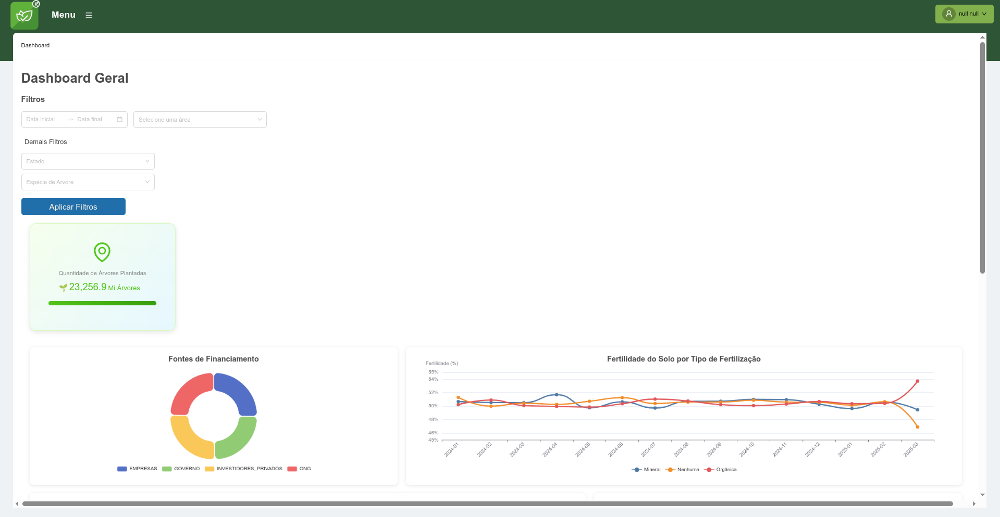
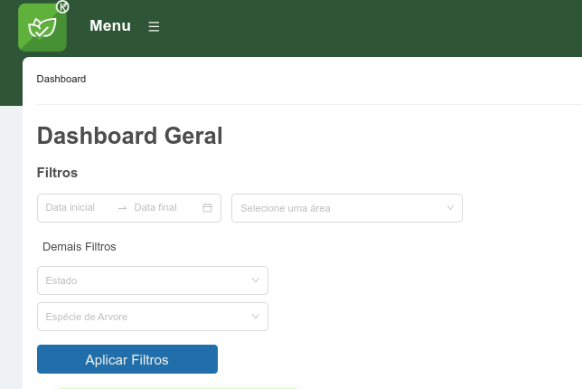
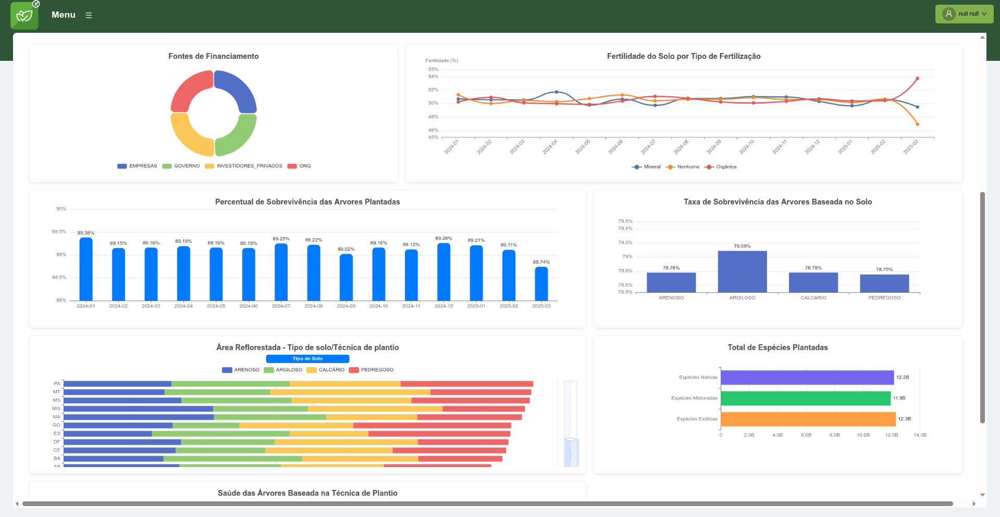
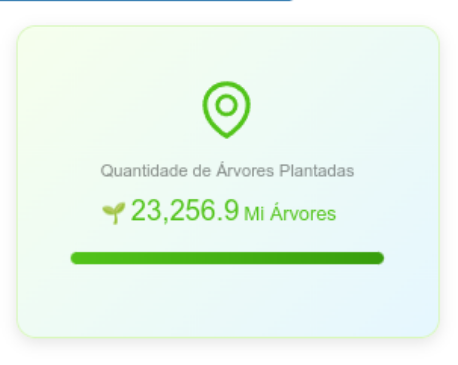
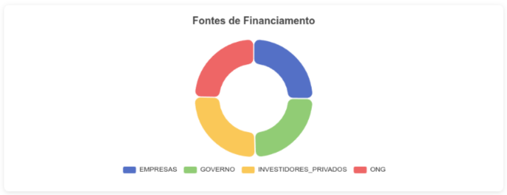
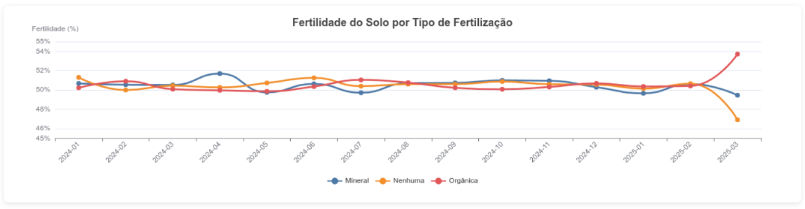
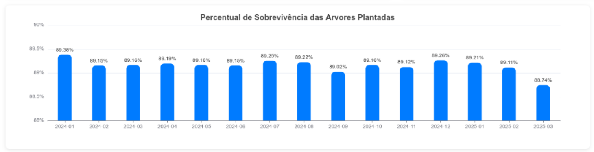
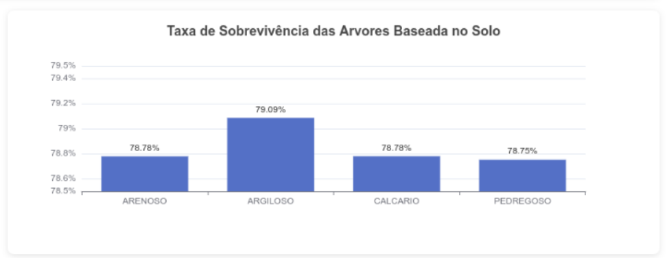
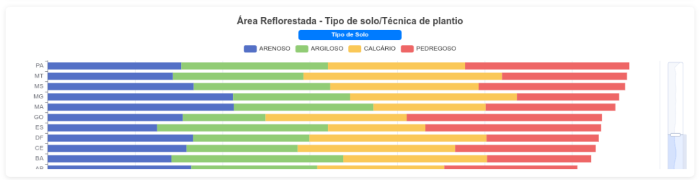
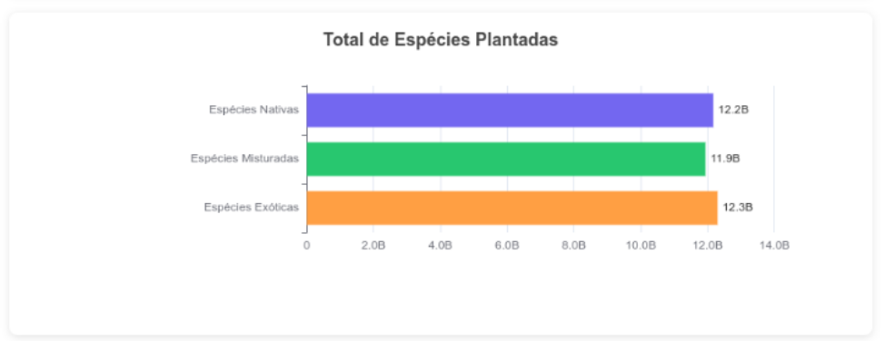

# Dashboard
O dashboard é a primeira tela a ser visualizada após o login. Ao navegar por esta tela o usuário encontrará um panorama geral sobre a situação atual das áreas reflorestadas.
Conforme a imagem abaixo, está página é dividida em duas partes: No topo a encontram-se os filtros para refinamento das informações e abaixo deles os gráficos que resumem as informações históricas das áreas.

## Filtros
Alguns gráficos obtém informações de acordo com os filtros abaixo. As possibilidades de filtragem são por períodos de datas, Unidade Federativa e espécie de árvores.

## Gráficos
Abaixo está uma imagem mais completa dos gráficos existentes no dashboard. 

Como pode-se observar, o dashboard é composto por vários gráficos sendo eles:

- Quantidade de árvores plantadas;
- Fontes de Financiamento;
- Fertilidade do solo por tipo de fertilização;
- Percentual de sobrevivência das árvores;
- Taxa de sobrevivência das árvores por tipo de solo;
- Área reflorestada por UF e por tipo de solo/técnica de plantio;
- Total de Espécies plantadas;
- Saúde das árvores baseada na técnica de plantio.

### Quantidade de árvores plantadas

### Fontes de Financiamento
Consolida as fontes de financiamento das áreas reflorestadas.

### Fertilidade do solo por tipo de fertilização
Consolida o índice de fertilidade do solo de acordo com o tipo de fertilização aplicada.

### Percentual de sobrevivência das árvores
Esse gráfico fornece um panorâmico histórico das taxas de sobrevivência das árvores ao longo do tempo.

### Taxa de sobrevivência das árvores por tipo de solo
Diferente do gráfico anterior, aqui é possível compreender a taxa de sobrevivência em relação ao tipo de solo. 

### Área reflorestada por UF
As áreas reflorestadas são diferentes em cada estado. Nesse gráfico é possível realizar esta comparação. Outra informação apresentada é área reflorestada por tipo de solo ou por técnica de plantio aplicada.

### Total de Espécies plantadas
Aqui é feito um comparativo das espécies plantadas, sendo Nativas, Exóticas ou Misturadas.

### Saúde das árvores/Técnica de plantio
Este gráfico apresenta o estado de saúde das árvores conforme a técnica aplicada durante o plantio.
