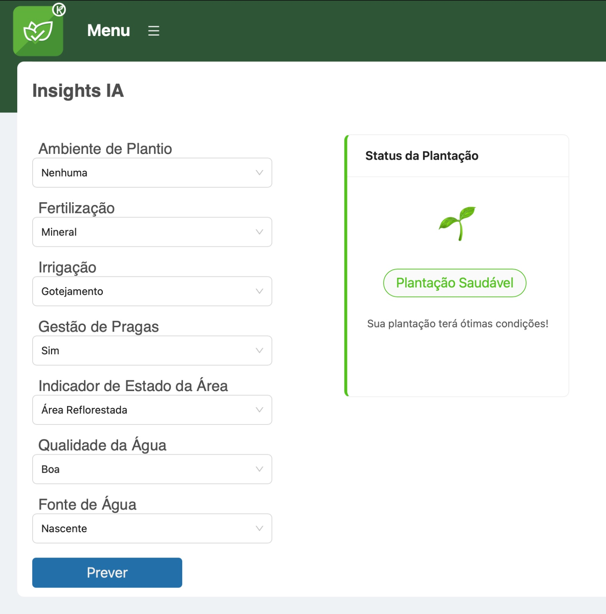
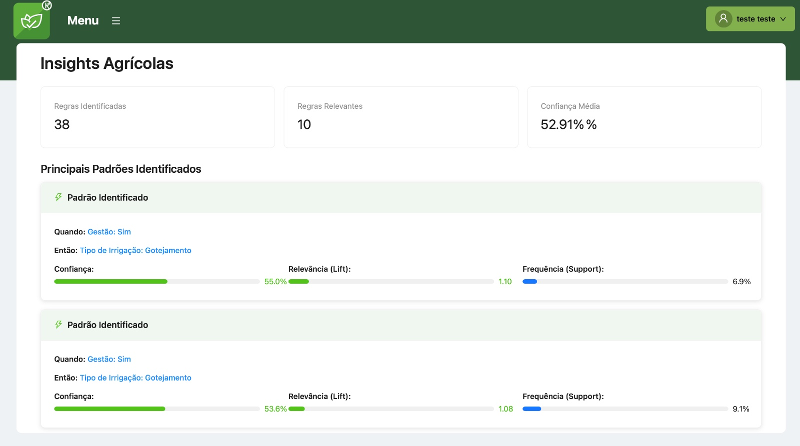
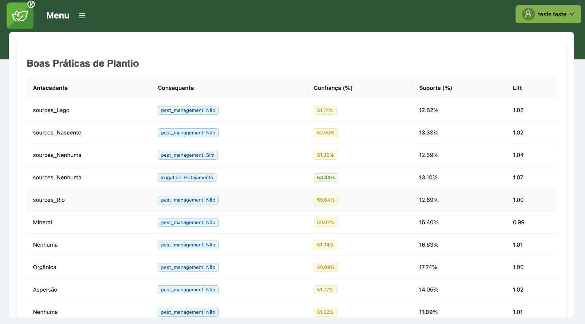

# Insights IA
Essa funcionalidade permite ao gestor uma previsão sobre a situação futura da plantação. Para cálculo dessas previsões, foi criado um Modelo de Inteligência Artificial com dados históricos coletados. Então quando o usuário realiza entrada de algumas informações de seu interesse, essas opções são submetidas ao modelo de IA que retorna o resultado que é apresentado ao gestor.

## Acesso

1. Clicar em Menu
2. Clicar e Insights IA

# Funcionalidade
## Escolher opções

O primeiro passo é escolher as opções variáveis do sistema de plantio que são: 

- Ambiente de plantio;
- Fertilização;
- Irrigação;
- Gestão de pragas;
- Estado da área;
- Qualidade da água e;
- Fonte de água.

Por meio dessas variáveis é que o sistema calcula por seu modelo de IA as previsões mostradas no próximo tópico.

## Previsão gerada
As telas a seguir são previsões da possibilidade de sucesso do empreendimento de acordo com as escolhas do usuário.

