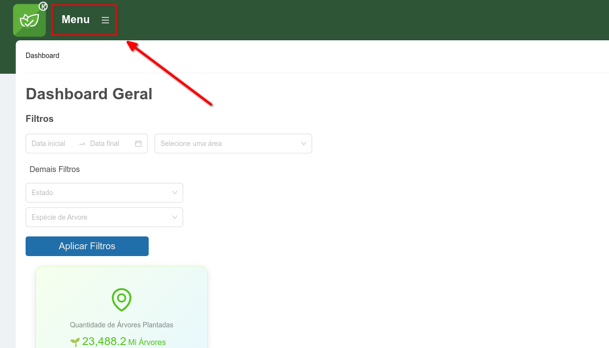
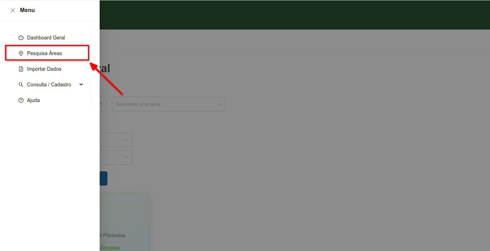
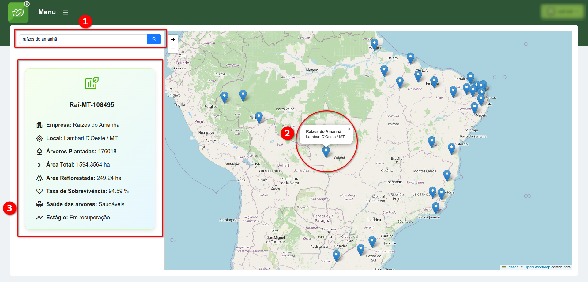

# Pesquisa por Áreas
Esta funcionalidade permite ao usuário buscar por uma área pesquisando pelo próprio nome da Área, Cidade ou Empresa.

## Realizar uma pesquisa
1. Abrir o menu lateral

 

1. No menu lateral, acessar a opção **Pesquisa Áreas**

 

1. Pesquisar e vizualizar áreas:
    - Na **barra de pesquisa(1)**, digite o nome da Área, Cidade ou Empresa e clique na **lupa(1)**.
    - Clicar em um dos **pontos(2)** que  no mapa.
    - Um **card(3)** com informações da área aparecerá abaixo da barra de pesquisa.

